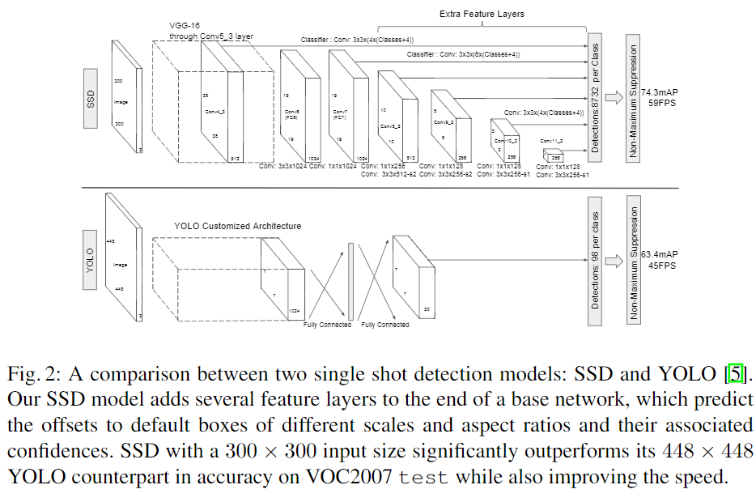
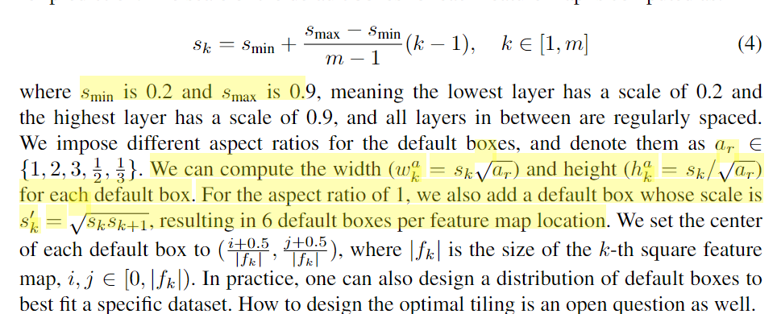

## 写在开头

* [arxiv article](http://arxiv.org/abs/1512.02325)
* [SSD: Single Shot MultiBox Detector](2016-SSD%20Single%20Shot%20MultiBox%20Detector.pdf)
* [代码整理](https://github.com/jiye-ML/SSD.git)

## 论文阅读

### 摘要

* 将检测过程整合成一个 single deep neural network。便于训练与优化，同时提高检测速度。
* SSD 将输出一系列离散化（discretization） 的 bounding boxes，这些 bounding boxes 是在 不同层次（layers） 上的 feature maps 上生成的，并且有着不同的 aspect ratio。
* 在 prediction 阶段：
    * 计算出每一个 default box 中的物体，其属于每个类别的可能性，如对于 PASCAL VOC 数据集，总共有 20 类，那么得出每一个 bounding box 中物体属于这 20 个类别的每一种的可能性。
    * 对这些 bounding boxes 的 shape 进行微调，以使得其符合物体的 外接矩形。
    * 为了处理相同物体的不同尺寸的情况，SSD 结合了不同分辨率的 feature maps 的 prediction
    
### 1. Introduction

* 以前的网络：
    * 假设包围框
    * 重新采样像素点或者特征图对于每个框
    * 使用分类器
* 我们网络的性能：
    * 59 FPS with mAP 74.3% on voc2007 test
* 我们所做的提升：
    * 使用小的卷积核预测物体类别和框坐标的偏移，
    * 使用单独的预测器在不同的ratio下检测
    * 使用这些预测器在不同的特征图上检测
* 我们的贡献：
    1. 提出SSD网络，
    2. SSD的核心是在特征图上使用小的卷积核预测分类分数和一系列固定尺寸的默认框的box偏移
    3. 在不同尺寸特征图上，使用不同的aspect ratio 单独预测
    4. 端对端训练
    5. 实验分析
    

### 2. The Single Shot Detector (SSD) 

> 两个重要的概念 default box 以及 feature map cell   

1. feature map cell 就是将 feature map 切分成 或者 之后的一个个格子；
2. default box 就是每一个格子上，一系列固定大小的 box，即图中虚线所形成的一系列 boxes。



* groundtruth的特殊处理
    * 首先匹配default box和ground truth box
    * 匹配到了属于正样本，没有匹配到的框为负样本


#### Model

> SSD是基于一个前向传播CNN网络，产生一系列固定大小的bounding boxes，以及每一个box中包含物体实例的可能性，即 score。
之后，进行一个非极大值抑制得到最终的 predictions。

* SSD模型：VGG+额外辅助的网络：
    * Multi-scale feature maps for detection \
    多尺度特征
    
    * Convolutional predictors for detection \
    同一尺度下特征图不同固定大小的预测框
    
    * Default boxes and aspect ratios \
        * 对于给定位置计算k个框
        * 对于每个框（c类 + 4个偏移量）
        * m*n的特征图计算量 （c+4）*k*m*n
    



#### Training

> SSD与其它网络关键区别：ground true需要与特殊的输出匹配

* 一些关键问题：
    * 选择一系列 default boxes
    * 选择上文中提到的 scales 的问题
    * hard negative mining
    * 数据增广的策略


##### 1. Matching strategy： 匹配策略

如何将groundtruth boxes与default boxes进行配对，以组成 label 呢？ 
* 我们选择default box来自不同坐标、不同尺寸、不同ratio的全部default box
* 匹配每一个ground truth box与这全部的default box，得到jaccard overlap
* 只要两者之间的 jaccard overlap 大于一个阈值，这里本文的阈值为 0.5。 

##### 2. Training objective：

* SSD训练的目标函数源自于 MultiBox 的目标函数，但是本文将其拓展，使其可以处理多个目标类别。
* loss定义： 分类置信+定位  （N表示匹配的默认框的数目 没有的 loss = 0）  \
   

* 定位： loc损失为Smooth L1损失：预测框L和ground truth之间的offset \
 这里只是计算了匹配框的    
  

* 某一类的置信度（c）的softmax loss ,这里涉及到了正负样本   \
 


##### 3. Choosing scales and aspect ratios for default boxes

* 使用低层和高层的特征图做检测
* 计算一层的框的尺寸 sk
* 每个点产生6个box      
    * 1， 2， 3， 1/2, 1/3 
    * 额外加一个 尺寸为 sqrt(sk * sk+1)
* 每个点的偏移量 (i + 0.5, j + 0.5) / abs(fk)
    
   


##### 4. Hard negative mining 正负样本选择

* 根据 highest confidence loss,排序，挑选最高的
* negative ：positive = 3：1

##### 5. Data augmentation
* 每张图片采用下面方式之一：
    * 使用原图
    * 最小jaccard overlap 0.1, 0.3, 0.5, 0.7, 0.9采样
    * 随机采样
    

### reference 

* [论文阅读：SSD: Single Shot MultiBox Detector](http://blog.csdn.net/u010167269/article/details/52563573)
* [【深度学习：目标检测】RCNN学习笔记(10)：SSD:Single Shot MultiBox Detector](http://blog.csdn.net/smf0504/article/details/52745070)
* [目标检测算法之SSD](http://mp.weixin.qq.com/s?__biz=MzUyMjE2MTE0Mw==&mid=2247485558&idx=2&sn=d9b61680e523da49445f202f1fbb6954&chksm=f9d156eecea6dff8894f7ca6a1dd7a915c24c946cdc396ca5151e3cee0013ca8bf0552311482&mpshare=1&scene=1&srcid=0209syioGHqE9f3G8gwNyl9P#rd)


